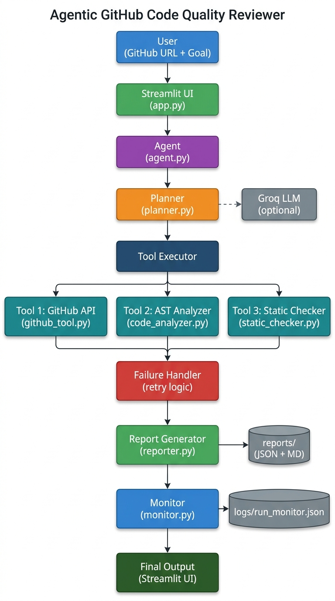

# 🔍 Agentic GitHub Code Quality Reviewer

An agentic AI system that autonomously analyzes GitHub repositories for code quality issues, handles failures gracefully, and generates structured reports.

Built as a take-home assignment for an AI Engineer Internship.

---

## Overview

The agent accepts a GitHub repository URL and a natural-language goal, then:

1. **Plans** — creates a visible execution plan before doing anything
2. **Fetches** — uses the GitHub REST API to get repository metadata and file contents
3. **Analyzes** — runs Python AST-based static analysis to detect real code quality issues
4. **Recovers** — detects and retries on tool failures
5. **Reports** — generates a structured JSON + Markdown report with findings, metrics, and recommendations

---

## Why This Project?

GitHub code quality review is a genuinely useful agentic task: the agent must discover information, make decisions about what to analyze, use multiple tools with different responsibilities, handle real-world failures (rate limits, 404s, network errors), and synthesize findings into something actionable. It naturally demonstrates all key agentic properties without artificial complexity.

---

## Features

- ✅ Natural-language goal input
- ✅ Visible execution plan shown before each run
- ✅ **Three distinct tools**: GitHub API + Python AST Analyzer + py_compile Static Checker
- ✅ Deliberate failure injection + retry/recovery (UI checkbox)
- ✅ Structured JSON and Markdown report — downloaded or auto-saved to `reports/`
- ✅ Secret detection (pattern-based, **masked** in output — never printed in plain text)
- ✅ Monitoring dashboard (live aggregate run metrics in Streamlit)
- ✅ Evaluation framework: Precision=1.0, Recall=1.0, F1=1.0 on synthetic test data
- ✅ **LLM via Groq** (free, configured) — AI-generated plan + report narrative
- ✅ Full fallback when LLM is unavailable — project works without any API key

---

## Architecture



See [`docs/architecture.md`](docs/architecture.md) for the full Mermaid diagram and component details.

```
User → Streamlit UI → Agent → Planner ──(optional)──→ Groq LLM
                                ↓
                         Tool Executor
                         ├── Tool 1: GitHub Repository Tool
                         ├── Tool 2: Code Quality Analyzer (AST)
                         └── Tool 3: Static Checker (py_compile)
                                ↓
                         Failure Handler (retry up to 2 attempts)
                                ↓
                         Report Generator → reports/ (JSON + MD)
                                ↓
                         Monitor → logs/run_monitor.json
```

---

## Tech Stack

| Layer | Technology |
|-------|-----------|
| UI | Streamlit |
| HTTP | requests |
| Code Analysis | Python `ast` (standard library) |
| Static Check | Python `py_compile` (standard library) |
| LLM | **Groq** (`llama-3.1-8b-instant`) — free, OpenAI-compatible |
| Testing | pytest (53 tests) |
| Config | python-dotenv |

**No unnecessary dependencies.** The entire core analysis stack is standard library only.

---

## Project Structure

```
agentic-code-review-agent/
│
├── app.py                          # Streamlit UI
├── conftest.py                     # pytest path setup
├── pytest.ini                      # pytest configuration
├── pyproject.toml                  # project metadata
├── requirements.txt
├── .env                            # ← your API keys (never committed)
├── .env.example                    # template for .env
├── .gitignore
│
├── src/
│   ├── agent.py                    # Main agent orchestrator (7 steps)
│   ├── planner.py                  # Plan generation + Groq LLM refinement
│   ├── github_tool.py              # Tool 1: GitHub REST API
│   ├── code_analyzer.py            # Tool 2: Python AST analysis (10 checks)
│   ├── static_checker.py           # Tool 3: py_compile + AST static checks
│   ├── reporter.py                 # JSON + Markdown report builder
│   ├── monitor.py                  # Run metrics logger
│   ├── evaluator.py                # Precision/recall/F1 evaluation
│   └── models.py                   # Shared dataclasses
│
├── tests/                          # 53 pytest tests
│   ├── test_github_tool.py
│   ├── test_code_analyzer.py
│   ├── test_agent.py
│   ├── test_evaluator.py
│   └── test_static_checker.py
│
├── evaluation/
│   ├── ground_truth.json           # Expected findings per test file
│   ├── run_evaluation.py           # Evaluation runner script
│   ├── evaluation_results.json     # Actual results (P=1.0, R=1.0, F1=1.0)
│   └── test_traces/                # Labeled behavioral traces (3 scenarios)
│
├── test_repositories/
│   └── sample_bad_repo/
│       └── bad_code.py             # Synthetic file with 8 known planted issues
│
├── logs/
│   ├── sample_success_run.md           # Representative sample transcript (success scenario)
│   ├── sample_failure_recovery_run.md  # Representative sample transcript (failure + recovery)
│   └── sample_invalid_input_run.md     # Representative sample transcript (invalid input)
│                                       # Note: these are authored sample logs showing expected
│                                       # agent behaviour; actual live output is saved to reports/
│
├── docs/
│   ├── architecture.md             # Full Mermaid diagram + component table
│   ├── architecture.png            # Visual architecture diagram
│   ├── writeup.md                  # Technical write-up (~1 page)
│   └── form_answers.md             # Draft answers for submission form
│
└── reports/                        # Auto-generated reports saved here at runtime
```

---

## Setup

```bash
git clone https://github.com/roylaxmikanta/agentic-code-review-agent
cd agentic-code-review-agent

python -m venv venv
# Windows:
venv\Scripts\activate
# macOS/Linux:
source venv/bin/activate

pip install -r requirements.txt
```

---

## Environment Variables (`.env`)

The `.env` file is already configured with:

```env
# Groq LLM — free, OpenAI-compatible
LLM_API_KEY=gsk_...          ← your Groq key
LLM_MODEL=llama-3.1-8b-instant
LLM_BASE_URL=https://api.groq.com/openai/v1

# GitHub Token (optional — raises rate limit 60 → 5000 req/hr)
GITHUB_TOKEN=

# Analysis limits
MAX_FILES=30
MAX_FILE_SIZE=50000
```

> **New to this project?** Copy the template:
> ```bash
> cp .env.example .env
> # then fill in your Groq key from https://console.groq.com
> ```

### Why Groq?

| | Groq ✅ | HuggingFace ❌ |
|--|---------|--------------|
| API format | OpenAI-compatible — **zero code changes** | Different format — needs separate code path |
| Free tier | 14,400 req/day · 6,000 tokens/min | Slower, rate-limited on free tier |
| Speed | Very fast (LPU hardware) | Slower on shared inference |
| Integration effort | Just set 3 env vars | Significant code changes needed |

### What Groq Enables

With `LLM_API_KEY` set, Groq is used for:
1. **Plan refinement** — the goal text (not code) is sent to Groq to optionally improve the 7-step plan
2. **Report narrative** — a 3–4 sentence AI assessment based on findings *counts and categories only* (no raw code is ever sent)

Without `LLM_API_KEY`, both steps fall back to deterministic Python logic — the project works identically.

---

## Run

```bash
streamlit run app.py
```

Open **`http://localhost:8501`** in your browser.

---

## Example Input

```
Repository URL:  https://github.com/psf/requests
Goal:            Analyze this GitHub repository and identify potential code quality issues and suggest fixes.
```

---

## How the Agent Works

### Step-by-Step Flow

| Step | Action | Tool Used |
|------|--------|-----------|
| 1 | Validate GitHub URL (regex, no network call) | — |
| 2 | Fetch repository metadata | Tool 1: GitHub API |
| 3 | Fetch repository file tree | Tool 1: GitHub API |
| 4 | Select Python files (filter by extension + size) | — |
| 5 | Download and analyze source files | Tool 1 + Tool 2 + Tool 3 |
| 6 | Deduplicate and prioritize findings | — |
| 7 | Generate report + optional Groq narrative | Groq LLM (optional) |

### Tool 1 — GitHub Repository Tool (`src/github_tool.py`)
- Regex-validates the URL
- Fetches repo metadata (language, stars, default branch)
- Gets the file tree via Git Trees API
- Downloads raw file content

### Tool 2 — Code Quality Analyzer (`src/code_analyzer.py`)
Uses Python's built-in `ast` module. Detects:

| Check | Threshold |
|-------|-----------|
| Long functions | > 50 lines |
| Deep nesting | > 4 levels |
| Broad exceptions | `except:` or `except Exception:` |
| Missing docstrings | public functions only |
| Unused imports | name-match based |
| Too many arguments | > 6 |
| TODO / FIXME markers | any occurrence |
| Long lines | > 120 characters |
| Hardcoded secrets | password/api_key/token patterns — **masked in output** |
| Syntax errors | invalid Python |

### Tool 3 — Static Checker (`src/static_checker.py`)
Uses `py_compile` + `ast`. Optional — can be toggled in UI. Detects:
- Compile-time syntax errors
- Silently suppressed exceptions (`except: pass`)
- Unreachable code after `return`/`raise`
- Stub functions (docstring or `pass` only, no implementation)

---

## Failure Simulation

Check **"🔥 Simulate tool failure"** in the UI.

```
[2/7] Fetching repository metadata...
  🔄 Attempt 1...
  ❌ ERROR — Simulated GitHub API timeout
  ⚠️  Failure detected. Initiating retry...
  🔄 Attempt 2...
  ✅ RECOVERED — Repository found: psf/requests
```

The agent:
1. Logs `RetryRecord(attempt=1, status="failed")` to state
2. Displays the error in red in the UI
3. Retries immediately (attempt 2)
4. Continues all remaining steps normally
5. Notes `"One failure recovered through retry"` in the final report

---

## Testing

```bash
pytest
# or explicitly:
pytest tests/ -v
```

**53 tests** — all pass:

| File | Tests | What's covered |
|------|-------|---------------|
| `test_github_tool.py` | 11 | URL parsing, simulated failure, ToolResult structure |
| `test_code_analyzer.py` | 18 | All 10 check types + metrics calculation |
| `test_agent.py` | 6 | Retry logic, recovery records, report structure |
| `test_evaluator.py` | 11 | Label mapping, P/R/F1 math, division-by-zero safety |
| `test_static_checker.py` | 7 | Syntax check, suppressed exceptions, stub detection |

---

## Evaluation

```bash
python evaluation/run_evaluation.py
```

Runs the analyzer against the synthetic `bad_code.py` (8 deliberately planted issues) and compares against `evaluation/ground_truth.json`.

**Actual results** (saved in `evaluation/evaluation_results.json`):

```
Test Cases:      1  (bad_code.py — 8 planted issues)
True Positives:  8
False Positives: 0
False Negatives: 0

Precision: 1.0000
Recall:    1.0000
F1 Score:  1.0000
```

All 8 planted issues detected with zero false alarms:
`long_function` · `hardcoded_secret` · `broad_exception` · `todo` ·
`missing_docstring` · `unused_import` · `too_many_args` · `deep_nesting`

---

## Monitoring

The Streamlit UI includes a **live monitoring dashboard** at the bottom of the page:

| Metric | Description |
|--------|-------------|
| Total Runs | All runs recorded |
| Successful / Recovered / Failed | Run outcome breakdown |
| Total Tool Calls | Across all runs |
| Total Retries | Retry attempts triggered |
| Avg Execution Time | Mean seconds per run |
| Total Findings | Aggregate findings detected |

Raw data is persisted to `logs/run_monitor.json` and read at startup.

---

## Limitations

- **Python only** — AST analysis is language-specific. Other file types are skipped with a message.
- **Heuristic rules** — Intentionally simple. Not equivalent to Semgrep, Bandit, or SonarQube.
- **Secret detection** — Pattern-based; misses obfuscated or encrypted secrets.
- **Unused import detection** — Name-match only; may have false positives with dynamic imports.
- **GitHub API rate limits** — 60 req/hr unauthenticated, 5,000/hr with `GITHUB_TOKEN`.
- **Groq rate limits** — Free tier 6,000 tokens/min; very large repos may be throttled on narrative.
- **No PR integration** — Currently read-only. Does not post findings to GitHub.

---

## Future Improvements

- JavaScript/TypeScript support via tree-sitter
- Async file fetching for faster large-repo analysis
- GitHub Actions integration for automated PR review
- Persistent findings storage (SQLite) for trend analysis across runs
- Configurable rule sets per project (YAML config)
- Entropy-based secret detection (Shannon entropy on string literals)
- GitHub PR comment posting via API

---

## Assignment Deliverables

| Deliverable | Location | Status |
|-------------|----------|--------|
| Source code | `src/`, `app.py` | ✅ |
| Architecture diagram | `docs/architecture.png`, `docs/architecture.md` | ✅ |
| Sample run logs (×3) | `logs/` | ✅ |
| Technical write-up | `docs/writeup.md` | ✅ |
| Form answers draft | `docs/form_answers.md` | ✅ |
| Labeled test traces (×3) | `evaluation/test_traces/` | ✅ |
| Ground truth | `evaluation/ground_truth.json` | ✅ |
| Evaluation results | `evaluation/evaluation_results.json` | ✅ (P=1.0, R=1.0, F1=1.0) |
| Monitoring report | `logs/run_monitor.json` | ✅ (generated at runtime) |
