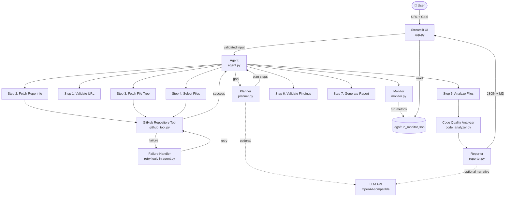

# Architecture

## System Overview



## Component Responsibilities

| Component | File | Responsibility |
|-----------|------|----------------|
| Streamlit UI | `app.py` | User input, step display, findings, downloads, monitoring |
| Agent | `src/agent.py` | Orchestrates all steps, handles retry logic |
| Planner | `src/planner.py` | Converts goal to execution plan, optional LLM refinement |
| GitHub Tool | `src/github_tool.py` | URL validation, repo metadata, file tree, file content |
| Code Analyzer | `src/code_analyzer.py` | AST-based Python quality analysis |
| Reporter | `src/reporter.py` | Builds JSON report, renders Markdown |
| Monitor | `src/monitor.py` | Records run metrics, computes aggregate stats |
| Models | `src/models.py` | Shared dataclasses (AgentState, Finding, ToolResult, etc.) |
| Evaluator | `src/evaluator.py` | Precision/recall/F1 evaluation framework |

## Data Flow

```
User Input (URL + Goal)
        │
        ▼
URL Validation (regex)
        │
        ▼
GitHub API → repo metadata → repo file tree → file contents
        │
        ▼ (if failure)
Retry Logic (up to 2 attempts)
        │
        ▼
AST Parser → Code Quality Findings
        │
        ▼
Deduplication + Severity Sort
        │
        ▼
Optional LLM Narrative (from findings summary, NOT raw code)
        │
        ▼
Structured Report (JSON + Markdown)
        │
        ▼
Monitor Log → Aggregate Statistics
```

## Tool Interface Contract

All tools return a `ToolResult`:

```python
@dataclass
class ToolResult:
    success: bool
    tool: str
    data: Optional[Any]
    error: Optional[str]
    attempt: int = 1
```

## Failure & Recovery

```
Attempt 1 → simulate_failure=True → ToolResult(success=False, error="Simulated timeout")
                                              │
                                              ▼
                                    RetryRecord logged
                                              │
                                              ▼
Attempt 2 → simulate_failure=False (attempt>1) → ToolResult(success=True)
                                              │
                                              ▼
                                    RetryRecord logged
                                    Execution continues
```
