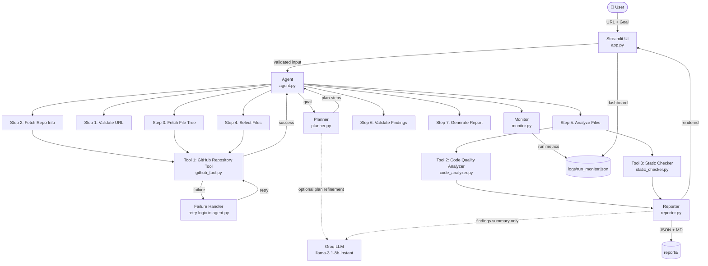

# Architecture

## Diagram


## System Overview



## Component Responsibilities

| Component | File | Responsibility |
|-----------|------|----------------|
| Streamlit UI | `app.py` | User input, step display, findings, downloads, monitoring dashboard |
| Agent | `src/agent.py` | Orchestrates all 7 steps, handles retry logic, saves reports |
| Planner | `src/planner.py` | Converts goal to execution plan; optional Groq LLM refinement |
| Tool 1: GitHub | `src/github_tool.py` | URL validation, repo metadata, file tree, file content |
| Tool 2: Analyzer | `src/code_analyzer.py` | AST-based Python quality analysis (10 check types) |
| Tool 3: Static | `src/static_checker.py` | py_compile syntax check + AST static checks |
| Reporter | `src/reporter.py` | Builds JSON report, renders Markdown |
| Monitor | `src/monitor.py` | Records per-run metrics, computes aggregate stats |
| Models | `src/models.py` | Shared dataclasses (AgentState, Finding, ToolResult, etc.) |
| Evaluator | `src/evaluator.py` | Precision/recall/F1 evaluation framework |

## Data Flow

```
User Input (URL + Goal)
        │
        ▼
URL Validation (regex — no API call)
        │
        ▼
GitHub API → repo metadata → repo file tree → file contents (Tool 1)
        │
        ▼ (on failure)
Retry Logic (up to 2 attempts, logged as RetryRecord)
        │
        ▼
AST Parser → Code Quality Findings (Tool 2)
py_compile → Static Check Findings (Tool 3)
        │
        ▼
Deduplication + Severity Sort
        │
        ▼
Optional Groq Narrative  ←── findings summary ONLY (no raw code)
        │
        ▼
Structured Report → reports/ (JSON + MD)
        │
        ▼
Monitor Log → logs/run_monitor.json → Aggregate Stats in UI
```

## LLM Integration (Groq)

The LLM receives **only**:
- Repository name and language
- Count of findings per severity
- Top 3 finding categories

Raw source code is **never** sent to the LLM.

## Failure & Recovery Flow

```
Attempt 1 → simulate_failure=True
          → ToolResult(success=False, error="Simulated timeout")
          → RetryRecord(attempt=1, status="failed") logged
          ↓
Attempt 2 → simulate_failure=False (attempt > 1 skips injection)
          → ToolResult(success=True)
          → RetryRecord(attempt=2, status="success") logged
          ↓
Execution continues normally
Final report notes: "One failure recovered through retry"
```
